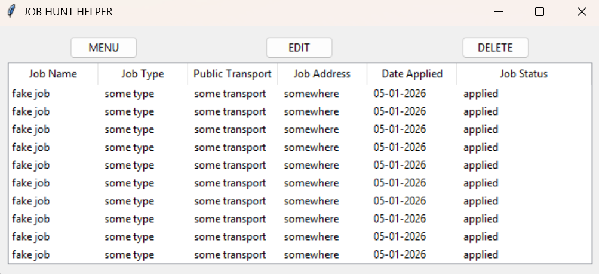
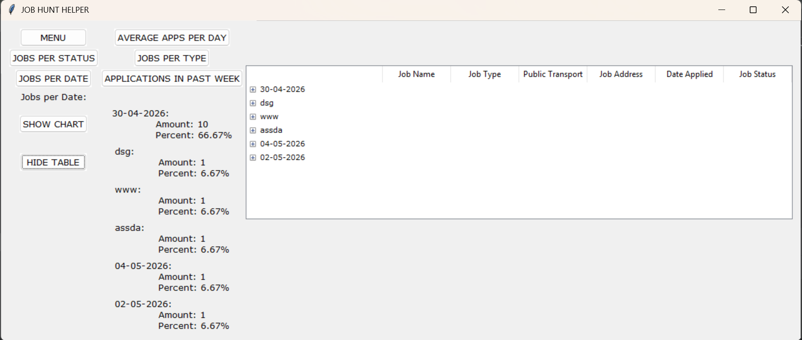
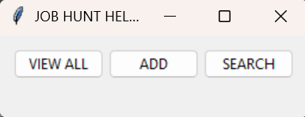
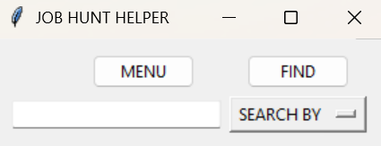
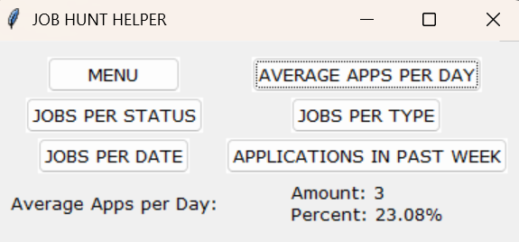

# Job Hunt Helper

Job hunting is a full-time job in itself. **Job Hunt Helper** is a desktop application built to take the organisational side off your plate — tracking every place you've applied to, the date, status, and even nearby public transport stops, all in one place.

---

## Download

**Latest Release:** [GitHub Releases](https://github.com/yourusername/job-application-tracker/releases)

- **v3.exe** — Recommended. Full-featured version with statistics dashboard and polished UI styling. Just download and run.
- **v1.exe** — Lightweight version with core features (add, view, search, edit, delete). Good if you prefer simplicity.

No installation needed — just download the `.exe` file and double-click to run.

---

## Features

- Add job applications with key details (role, type, address, transport, date, status)
- View all entries in a table
- Search entries by job name, date, status, type, or bus/tram stop
- Edit or delete entries as your job hunt progresses
- Data is saved locally to a CSV file, so nothing is lost between sessions
- **Statistics dashboard** showing amount and percentage breakdowns for each stat, with optional charts and grouped treeview tables where applicable *(v2+)*:
  - Average apps per day (excludes days with no applications)
  - Applications sent in the last 7 days, with a line chart showing the trend across the week
  - Applications grouped by status, type, or date — each with an optional chart and grouped treeview table
- **Styled UI** using a custom Verdana-based theme for a cleaner look and feel *(v3)*

---

## Screenshots







---

## Versions

| Version | Description | Best For |
|---|---|---|
| v1 | Full GUI with add, view, search, edit, and delete | Users who want the essentials without statistics |
| v3 | Adds statistics dashboard, charts, and polished UI styling | Users who want insights into their job hunt progress |

---

## Tech Stack

- **Python 3.9+**
- **tkinter** — GUI framework
- **pandas** — data management and CSV handling
- **matplotlib** — statistics charts *(v3)*

---

## Setup

### Using the .exe (Recommended)

1. Download `v1.exe` or `v3.exe` from the [Releases](https://github.com/yourusername/job-application-tracker/releases) page
2. Double-click the `.exe` file to run
3. Done! Your data is saved locally to a CSV file in the same folder

### Running from Source Code

If you'd prefer to run from Python source:

1. Make sure you have Python 3.9+ installed
2. Clone or download this repository
3. Install dependencies:

```
pip install -r requirements.txt
```

4. Run the app:

```
# v1
python v1/ui.py

# v3 (recommended)
python v3/ui.py
```

---

## Project Structure

```
job-application-tracker/
│
├── prototype/
│   ├── func.py                  # Core logic
│   ├── main.py                  # Entry point
│   └── jobs.csv                 # Data storage
│
├── v1/
│   ├── ui.py                    # Main UI and layout
│   ├── button_func.py           # Button actions and layout logic
│   ├── data_manager.py          # CSV read/write and data validation
│   └── popups.py                # Confirmation and error popups
│
├── v3/                          # Statistics + styling
│   ├── ui.py
│   ├── button_func.py
│   ├── data_manager.py
│   ├── popups.py
│   ├── stats_ui.py              # Statistics window and controls
│   ├── stats.py                 # Statistics calculations
│   ├── stats_trees.py           # Treeview tables for statistics
│   ├── visualization_brain.py   # matplotlib chart definitions
│   └── styleing.py              # Custom ttk theme and font styling
│
├── screenshots/
├── requirements.txt
└── README.md
```

---

## Each Job Entry Stores

| Field | Description |
|---|---|
| Job Name | Name of the workplace |
| Job Type | Type of role (e.g. Retail, Dev, Customer Service) |
| Public Transport | Nearby bus/tram/train stops |
| Job Address | Address of the workplace |
| Date Applied | The date you applied (DD-MM-YYYY) |
| Job Status | e.g. Waiting for response, Interview scheduled |

---

## Questions or Issues?

Found a bug? Have a feature request? Open an issue on GitHub or reach out.

Happy job hunting! 🎯

---

**If this helped you, consider supporting the project:**

☕ [Buy me a coffee](https://ko-fi.com/sara_czasak)
